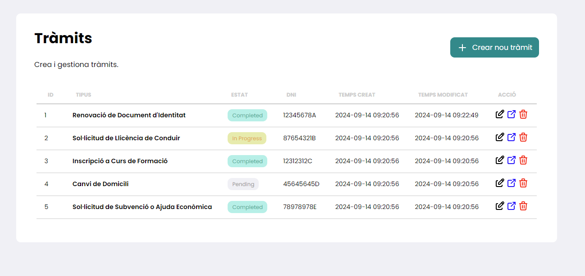
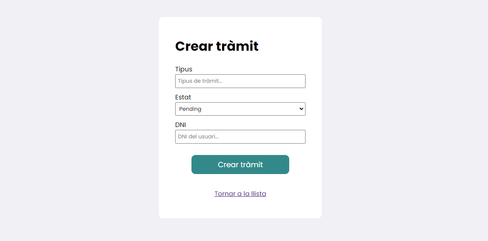
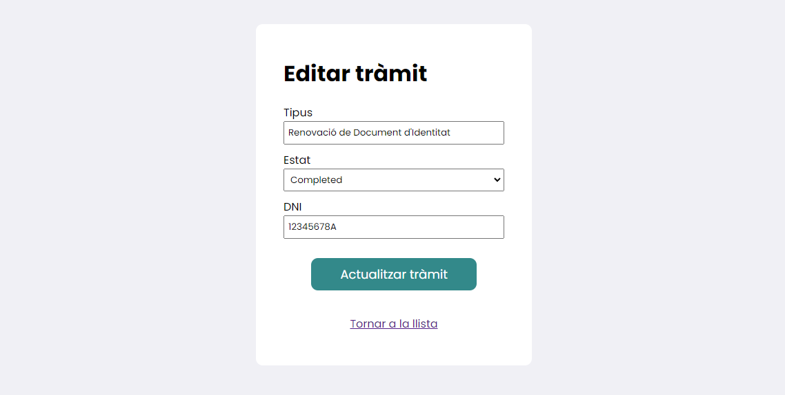
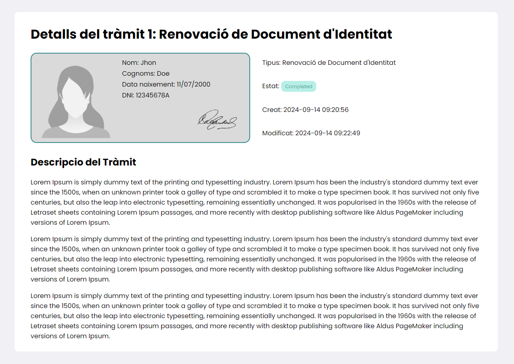

# Procedure CRUD Application




This is a small CRUD application designed to manage "procedures". The application provides a user-friendly interface with the following features:

- **Procedure List**: View all procedures.
- **Create Procedure**: Add new procedures by filling out a form with necessary information.
- **Edit Procedure**: Modify details of an existing procedure.
- **Delete Procedure**: Remove procedures from the system.
- **View Procedure Details**: Click on a procedure to see detailed information about it.

## Screens

### Create procedure



### Update procedure



### Procedure details



## API Functionality

Additionally, the app includes a **REST API** to interact with the procedures data:

- **GET /api/procedures**: Retrieves all procedures.
- **Filter by state**: Use the `state` query parameter to filter procedures by their status. The possible states are:
  - `pending`: Displays procedures that are in the "pending" state.
  - `inprogress`: Displays procedures that are currently in progress.
  - `completed`: Displays procedures that are marked as completed.

Example API usage:  
`/api/procedures?state=inprogress`
## Requirements

Before you begin, ensure you have met the following requirements:

1. **PHP**: Version 8.0 or higher.
2. **Composer**: Dependency manager for PHP.
3. **Database**: MySQL, PostgreSQL, SQLite, or SQL Server.
4. **Web Server**: Apache or Nginx.

> **Note:** I used XAMPP to make the local server.

## Installation Steps

Follow these steps to set up your Laravel application:

1. **Clone the repository**:
    ```bash
    git clone https://github.com/umigam3/laravel-crud.git
    cd laravel-crud
    ```

2. **Install Composer dependencies**:
    ```bash
    composer install
    ```

3. **Environment setup**:
   - Update the `.env` file with your database credentials and other configuration values.

        ```bash
        DB_CONNECTION=mysql
        DB_HOST=127.0.0.1
        DB_PORT=3306
        DB_DATABASE=your_database
        DB_USERNAME=root
        DB_PASSWORD=
        ```

4. **Run database migrations**:
    ```bash
    php artisan migrate
    ```

5. **Run database seeders**:
    ```bash
    php artisan db:seed
    ```

## Running the Application

To run the Laravel application locally, use the following command:
```bash
php artisan serve
```

This will start the development server on `http://127.0.0.1:8000`. To go to de main page, go to `http://127.0.0.1:8000/procedures`
